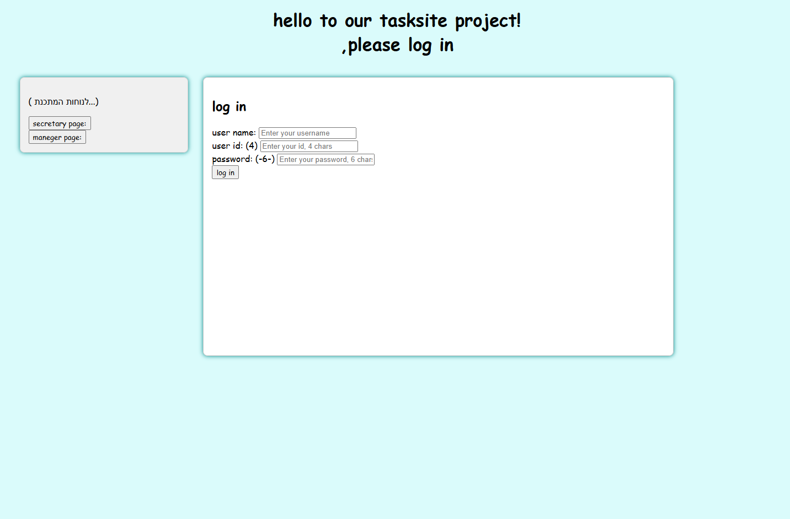
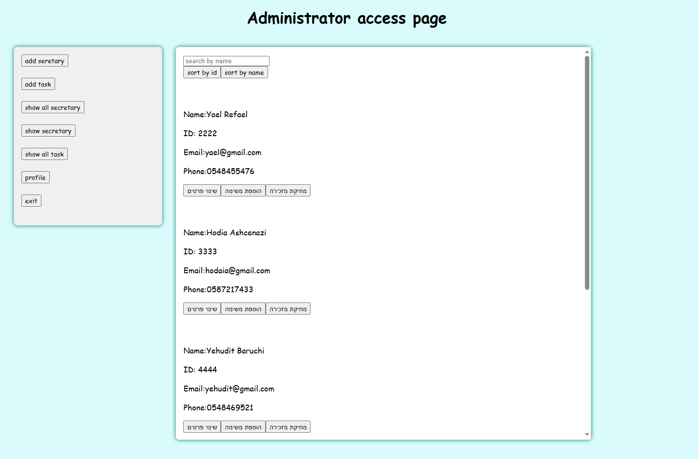
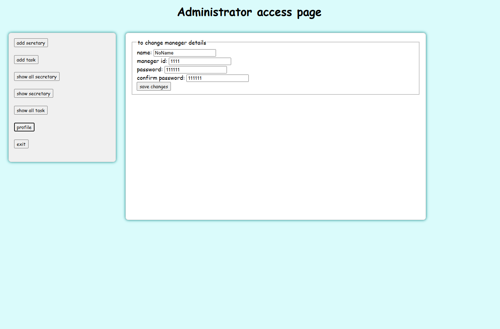
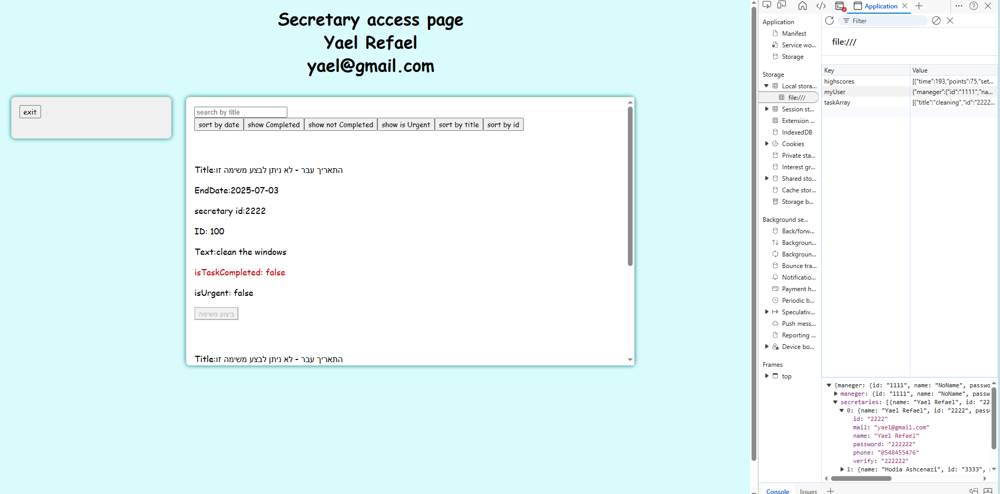

# Task Manager

מערכת המדמה תקשורת בין מנהל למזכירות לצורך יצירה, ניהול ומעקב אחר משימות.

הפרויקט פותח במסגרת פרויקט סיום בקורס Full Stack (FS), שנה א', במרכז האקדמי לב.

---

## אודות הפרויקט

Task Manager היא מערכת המדמה סביבת עבודה משרדית, שבה מנהל יכול ליצור ולנהל משימות עבור מזכירות, והמזכירות יכולות לצפות במשימות שהוקצו להן ולעדכן את סטטוס הביצוע שלהן.

הפרויקט נבנה במטרה לתרגל תכנון מערכת מלאה, עבודה בשכבות, ויישום עקרונות פיתוח המדמים תקשורת אמיתית בין לקוח לשרת.

---
## תכונות עיקריות

### מנהל
- הוספת מזכירות חדשות
- עריכת פרטי מזכירה
- צפייה ברשימת כל המזכירות
- יצירת משימות חדשות
- שיוך משימות למזכירות
- צפייה בכל המשימות במערכת
- עריכת פרטי המנהל
- סינון רשימות לפי פרמטרים שונים

### מזכירה

- צפייה במשימות שהוקצו לה
- סימון משימה כבוצעה
- סינון משימות
- מניעת השלמת משימה לאחר מועד היעד

---

## ארכיטקטורת המערכת

המערכת בנויה בצורה המדמה סביבת Client-Server מלאה.

למרות שאין שרת אמיתי או מסד נתונים חיצוני, כל הפעולות מתבצעות דרך שכבות נפרדות:

- Client
- Network
- FAJAX
- Server
- Database

גישה זו אפשרה תרגול של עקרונות פיתוח Full Stack גם ללא שימוש בשרת חיצוני.

---

## טכנולוגיות

- HTML
- CSS
- JavaScript
- Local Storage

---

## נושאים שנלמדו ויושמו

- Object Oriented Programming (OOP)
- עבודה בשכבות
- סימולציית Client-Server
- ניהול מידע באמצעות Local Storage
- תכנון מערכת לפני פיתוח
- הפרדת אחריות בין רכיבי המערכת
- סינון וחיפוש מידע

---

## מבנה הפרויקט

client/
├── html/
├── css/
└── js/
server_tasks/
server_users/
DataBase/
DNS server/
net/

---

## הרצה

1. הורידו את כל קבצי הפרויקט.
2. שמרו על מבנה התיקיות המקורי.
3. פתחו את הקובץ: client/html/site.html
4. המערכת תופעל בדפדפן.

---

## תמונות מסך

### מסך התחברות

### מסך מנהל

### מסך מזכירה

---

## עבודת צוות

הפרויקט פותח בזוג, כאשר העבודה התחלקה באופן שווה בין שני חברי הצוות לאורך כל שלבי התכנון, הפיתוח והבדיקות.

---

## מטרות הפרויקט

- תרגול פיתוח מערכת מלאה
- עבודה לפי ארכיטקטורת שכבות
- הבנת זרימת מידע בין לקוח לשרת
- יישום עקרונות OOP
- בניית בסיס לפיתוח מערכות מורכבות יותר בעתיד

---

## מידע אקדמי

פרויקט סיום קורס Full Stack (FS)  
שנה א'  
המרכז האקדמי לב

## הערות
בשל אופי הפרוייקט והייעוד שלו הדאטה בייס נבנה בצורה ידנית והוטען לlocal storage.
